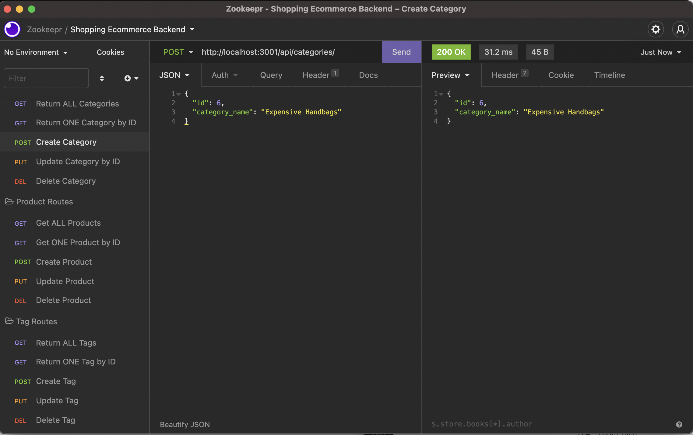

# Shopping E-commerce Back End

This is a project demonstrating the build of a back-end server for an e-commerce website. 

## Description

This back-end application uses Sequelize and Express.js to interact with a MySQL database and displays the creation of the sample e-commerce database using MySQL with related models and associations. The API routes demonstrate and perform RESTful CRUD operations.

When the database name and the MySQL login credentials are entered in an environment variable file (`.env`), the database is connected with the use of Sequelize. When MySQL is started in the command terminal, the schema is sourced for the database (`source db/schema.sql`) and is seeded to generate the files with `npm run seed`. To start the application, `node server.js` is entered in the terminal, starting the server and presenting the Sequelize models that are synced with the MySQL database. To access and test the routes, Insomnia is used and is able to generate data from each respective API GET route (for categories, products, or tags) with the use of formatted JSON or through the general fetch of obtaining the data all at once. API POST, PUT and DELETE routes also work for the data and is able to create, update, and delete any data within the database.

## Table of Contents
- [Description](#Description)
- [Installation](#Installation)
- [Usage](#Usage)
- [Developed With](#Developed-with)

## Installation
- The following npm packages listed in the `Developed With` tab are required to install in order to access and demonstrate the routes of the database.
- This file can be cloned through GitHub into your own repository by selecting the above Code button.
- To view the database through MySQL, please type `mysql -u root -p`. Please note that with the dotenv package, you will need to add your MySQL password in the respective .env file and add it to the .gitignore file in order to prevent confidental information from leaking.
- When in the MySQL command line, source the database by entering `source db/schema.sql;`.
- Then, `npm run seed` to seed the file and obtain data to generate through testing the routes.
- Start the server by entering `node server.js`.

## Usage
- Type `node server.js` to get started.
- The application allows the user to view, add, edit, and delete the seeded data (represented by categories, products, and tags) through Insomnia.

## Developed With
- MySQL2 - Continuation package of MySQL. Relational database management system that ensures fast connection to host servers and web databases. MySQL connects with the Express.js API to access the e-commerce database. - https://www.npmjs.com/package/mysql2
- Sequelize - Promise-based Node.js ORM for the MySQL server. Used alongside MySQL to connect with the Express.js API to access the e-commerce database. - https://sequelize.org/
- Express.js API - Web framework for Node.js, connected with MySQL 2 and Sequelize. - https://expressjs.com/
- dotenv - An npm package that protects and stores login credentials from other users through the .env file and MySQL. - https://www.npmjs.com/package/dotenv
- Insomnia - Collaborative API Client and Design Tool used to build and test APIs with an active server. - https://insomnia.rest/products/insomnia
- Javascript - Back-end Development
- Node.js - Back-end Developement